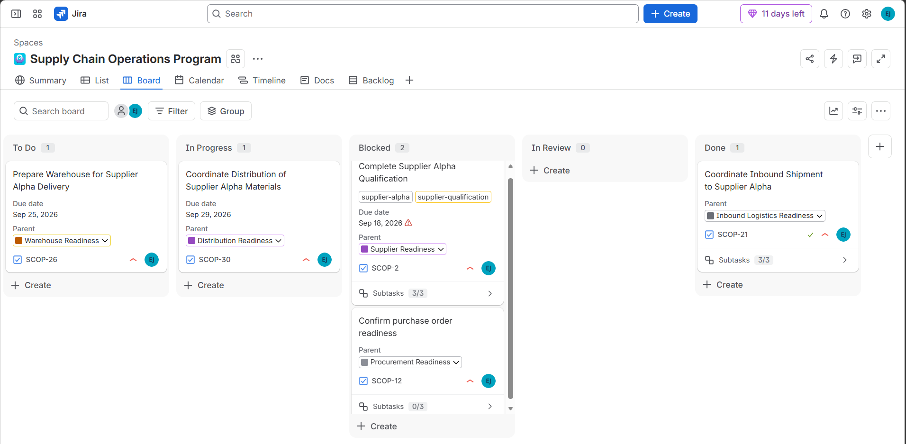
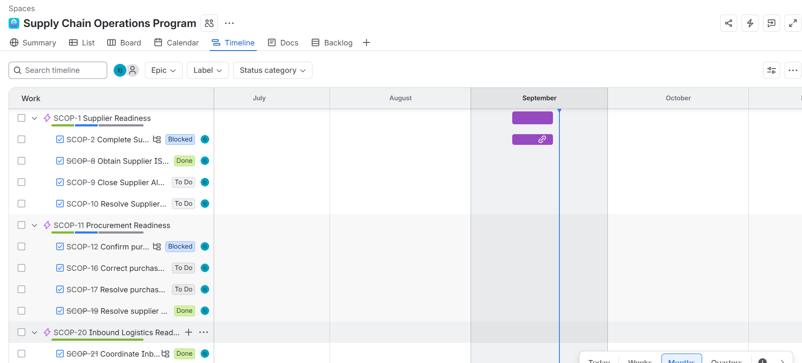
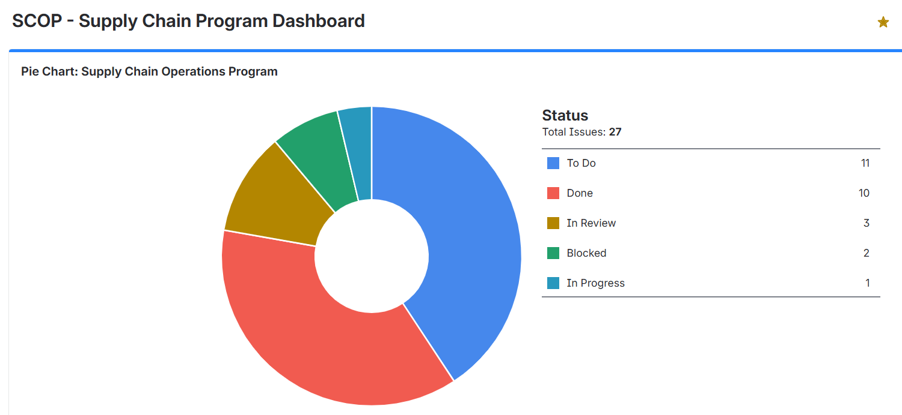
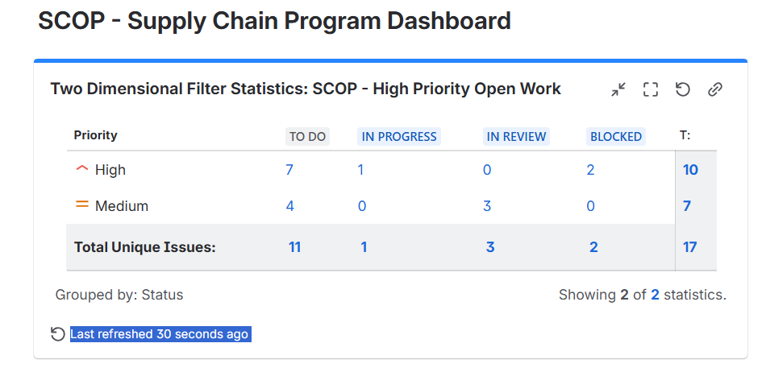
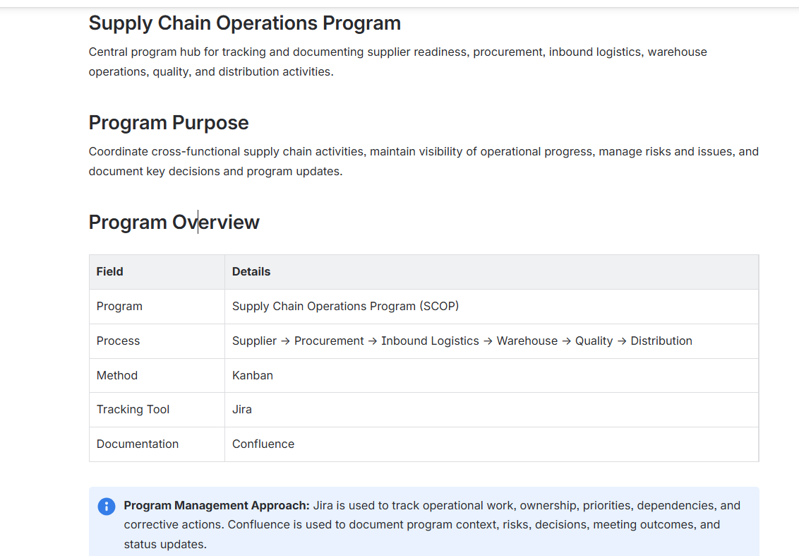
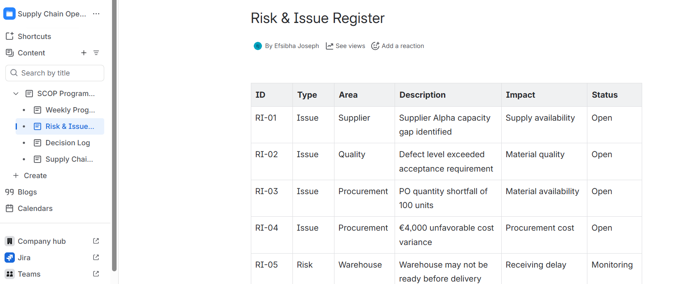
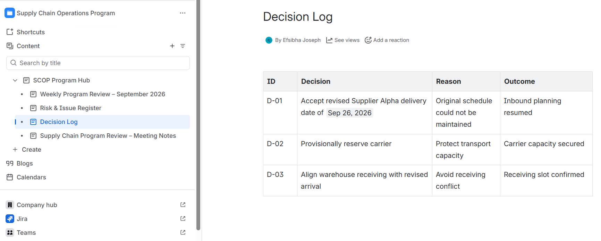
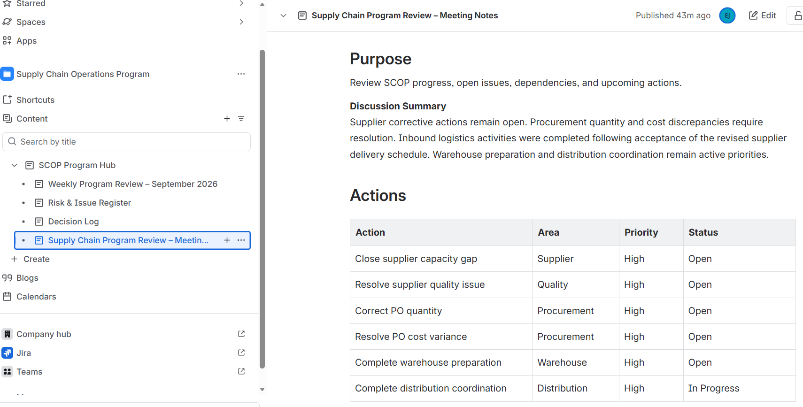

# Supply Chain Program Management

A hands-on simulated supply chain program management project demonstrating how Jira and Confluence can be used to coordinate cross-functional operations, track dependencies, manage risks and issues, and document program decisions.

## Project Overview

This project simulates the management of an end-to-end supply chain program covering:

Supplier → Procurement → Inbound Logistics → Warehouse → Quality → Distribution

The project was designed to develop practical experience with program tracking, operational coordination, risk management, and structured documentation.

## Business Scenario

A fictional European company is preparing materials from Supplier Alpha for operational use.

The program requires coordination across supplier readiness, purchasing, transportation, warehouse operations, quality inspection, and distribution.

During execution, several operational issues were introduced, including:

- Supplier capacity constraints
- Missing supplier documentation
- Quality defects
- Purchase order quantity shortfall
- Purchase order cost variance
- Supplier delivery delay
- Logistics and warehouse dependencies

Corrective actions were created and tracked through Jira.

## Tools

- Jira
- Confluence
- Kanban
- JQL
- Jira Dashboards

## Jira Program Structure

The program is divided into six workstreams:

1. Supplier Readiness
2. Procurement Readiness
3. Inbound Logistics Readiness
4. Warehouse Readiness
5. Quality Readiness
6. Distribution Readiness

Work was structured using:

**Epic → Task → Subtask**

Workflow:

**To Do → In Progress → Blocked → In Review → Done**

## Program Management Approach

Jira was used to manage:

- Work ownership
- Priorities
- Status tracking
- Dependencies
- Blockers
- Corrective actions
- Schedule visibility
- High-priority open work

Confluence was used to maintain:

- Program overview
- Weekly program reviews
- Risk and issue register
- Decision log
- Meeting notes

## Example Program Dependency

A supplier delivery delay affected several downstream activities.

The dependency chain was managed as:

**Supplier Delivery Resolution → Shipment Arrival Schedule → Warehouse Receiving Slot**

This demonstrates how upstream supply chain issues can affect downstream operational readiness.

## Dashboard & Reporting

A Jira dashboard was created to monitor:

- High-priority open work
- Work status distribution
- Blocked items
- Work in progress
- Program workload

A JQL filter was used to identify high-priority unfinished work:

`project = SCOP AND priority = High AND status != Done ORDER BY created DESC`

## Skills Demonstrated

- Supply Chain Program Management
- Cross-functional Coordination
- Jira
- Confluence
- Kanban Workflow Management
- Risk & Issue Management
- Dependency Tracking
- Corrective Action Tracking
- JQL
- Dashboard Reporting
- Program Documentation

## Project Type

Self-directed simulated project created for practical learning and portfolio demonstration.

## Project Evidence

### Jira Kanban Board

The Kanban board was used to manage operational work across To Do, In Progress, Blocked, In Review, and Done states.

### Jira Timeline

The timeline provides schedule visibility across supply chain workstreams and highlights dependencies between activities.

### Jira Program Dashboard

The dashboard provides visibility into work-item status and high-priority open work.

### Confluence Program Hub

Confluence was used as the central documentation layer for program context, reviews, risks, issues, decisions, and meeting outcomes.

### Risk and Issue Management

### Decision Management

### Program Review and Action Tracking

## Tools & Skills Demonstrated

- Jira: Kanban workflow, work-item tracking, priorities, dependencies, blockers, JQL filters, dashboards, and timeline planning
- Confluence: Program documentation, risk and issue register, decision log, weekly reviews, and meeting notes
- Supply Chain: Supplier readiness, procurement, inbound logistics, warehouse readiness, quality, and distribution
- Program Management: Cross-functional coordination, issue management, corrective actions, decision tracking, and status reporting
